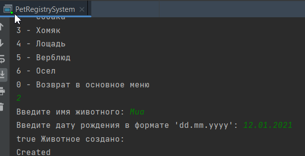

## Pet Registry System

This program simulates a registry of pets in a pet-friendly environment. It allows users to manage and interact with different types of pets.

### Functionality
1. **Add a New Pet**


   Users can add a new pet to the registry by providing details such as name, type, and commands it can perform.

2. **Classify Pets**


   The program can automatically assign a pet to the correct class based on its type (e.g., dog, cat, bird).

3.  **View Pet Commands**


   Users can view a list of commands that a specific pet can perform.

4.  **Train Pets with New Commands**


   Users can teach pets new commands to enhance their skills and abilities.

5.  **Menu Navigation**


   The program provides a structured menu system for easy navigation and interaction.

6.  **Counter Class Feature**


   A counter class is implemented with an add() method to increment a stored integer value when a new pet is added. This is designed to work seamlessly with try-with-resources, throwing an exception in case of misuse.

### Installation

To run the Pet Registry System, make sure you have Java installed on your system.

1. Clone the repository:

```git clone https://github.com/MilaEgoshina/pet-registry-system```

2. Go to the pet-registry-system directory

```cd pet-registry-system```

3.  Compile/run the main program.
```
javac PetRegistrySystem.java

java PetRegistrySystem
```
###  Usage

Follow the on-screen instructions to perform various actions within the program. Add new pets, train them, and explore the functionality of the Pet Registry System.




### Contributing

Feel free to contribute to the project by submitting bug reports, feature requests, or pull requests. Your input is valuable in enhancing the functionality and user experience of the Pet Registry System.